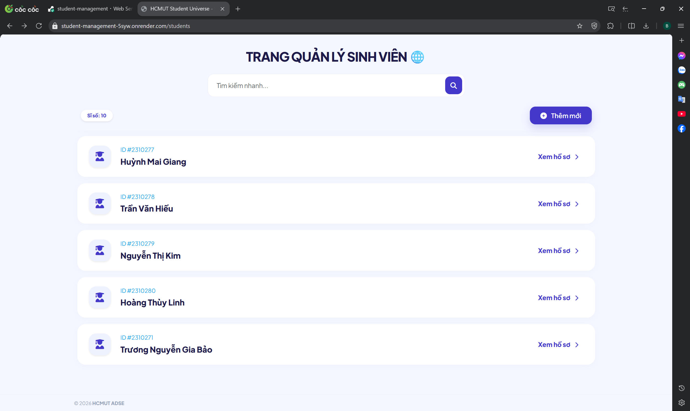
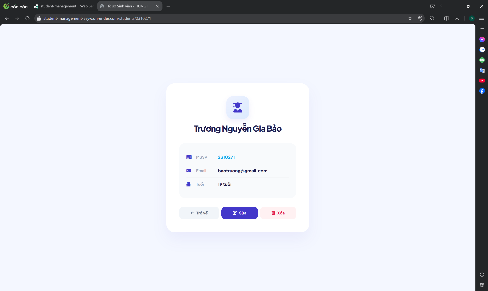
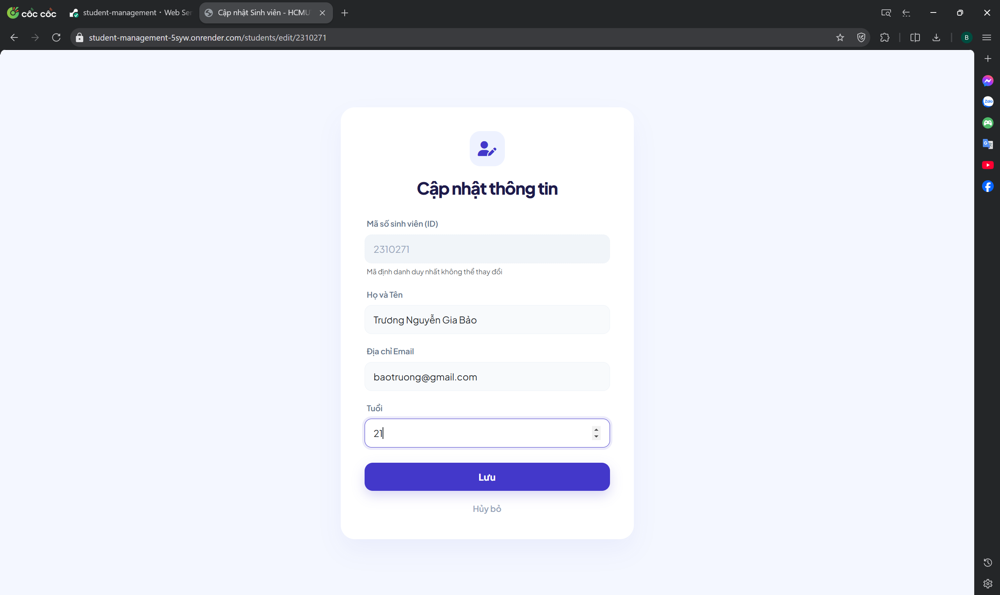
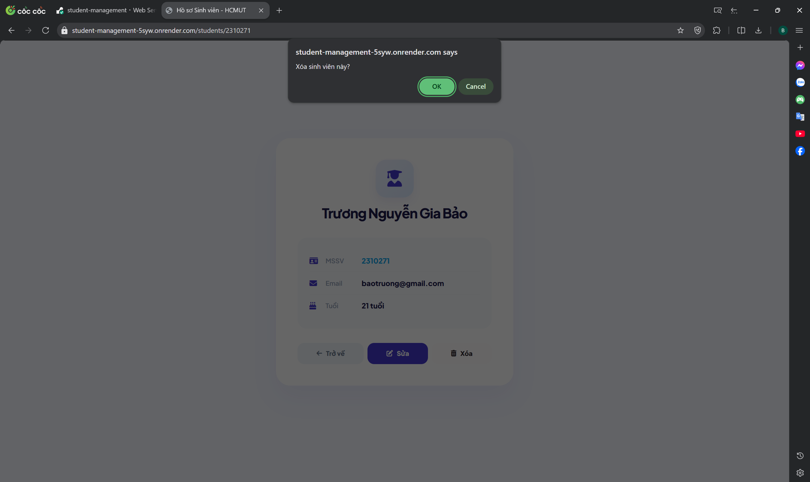
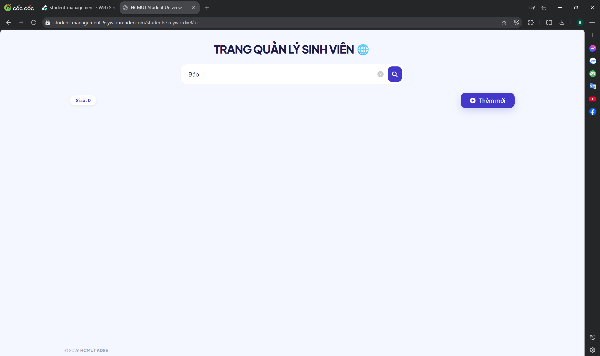
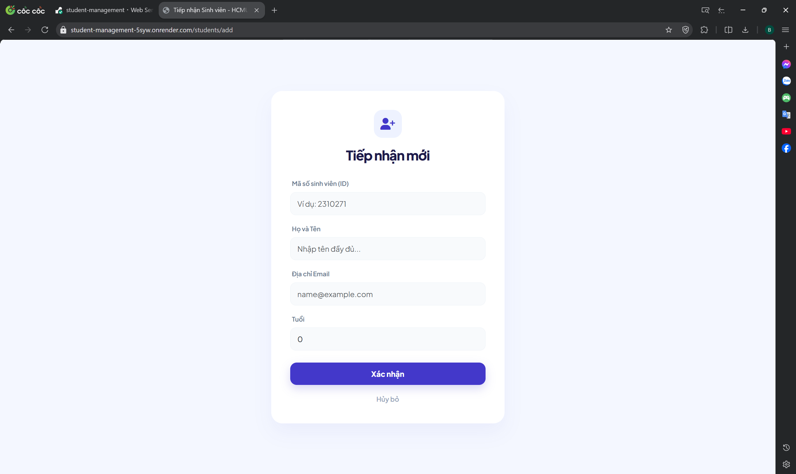

# Danh sách thành viên
| MSSV | Họ và tên |
| :--- | :--- |
| **2310271** | Trương Nguyễn Gia Bảo | 

# Deploy Web service
Ứng dụng đã được triển khai trực tuyến tại:
**[https://student-management-5syw.onrender.com/students](https://student-management-5syw.onrender.com/students)**
> **Lưu ý:** Do sử dụng Render Free Tier, dịch vụ sẽ tự động "đi ngủ" sau 15 phút không hoạt động. Thời gian khởi động lại (Cold Start) có thể mất từ 1-5 phút.
# Lab 4: Hoàn thiện sản phẩm
**Module 1: Danh sách sinh viên**
* Đường dẫn: {URL}/students

**Module 2: Trang chi tiết sinh viên**
* Đường dẫn: {URL}/students/id

Khi ấn vào nút xem hồ sơ một dòng dữ liệu sinh viên bất kì, chuyển đến trang chi tiết thông tin của sinh viên đó

**Tại trang này, ta có thể chỉnh sửa thông tin sinh viên hoặc xóa sinh viên.**
* Khi ấn sửa thông tin sinh viên, chuyển đến form sửa thông tin sinh viên.

  

* Sau khi ấn lưu, chuyển hướng về trang thông tin chi tiết của sinh viên vừa được chỉnh sửa với thông tin đã được cập nhật.

  

* Quay lại trang chi tiết sinh viên, khi ta ấn xóa, app sẽ hiện popup yêu cầu xác nhận
  
* Sau khi bấm xóa, chuyển về trang danh sách sinh viên và bản ghi đã được xóa thành công (không còn tìm kiếm được sinh viên tên Bảo)
  

**Module 3: Trang thêm mới sinh viên**
*Đường dẫn: {URL}/students/add

Khi ấn nút thêm sinh viên, form tạo sinh viên sẽ hiện lên

Sau khi ấn xác nhận, chuyển về trang hồ sơ sinh viên để kiểm tra coi đã điền đúng thông tin hay chưa
