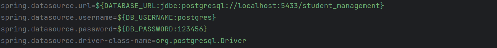
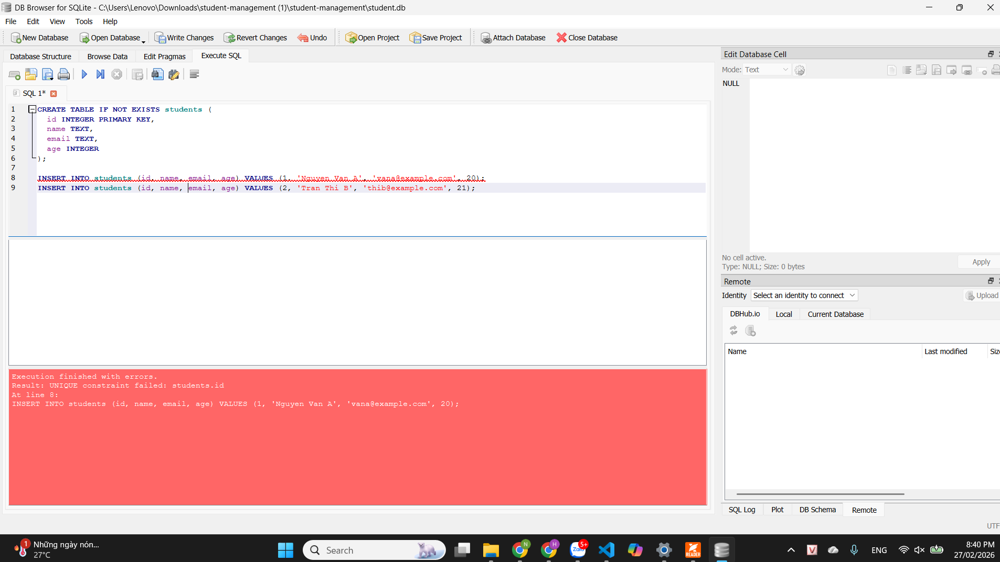
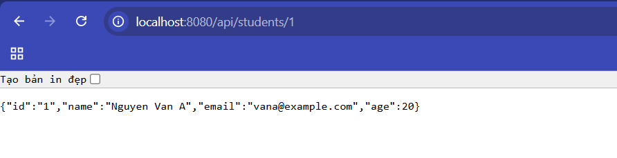
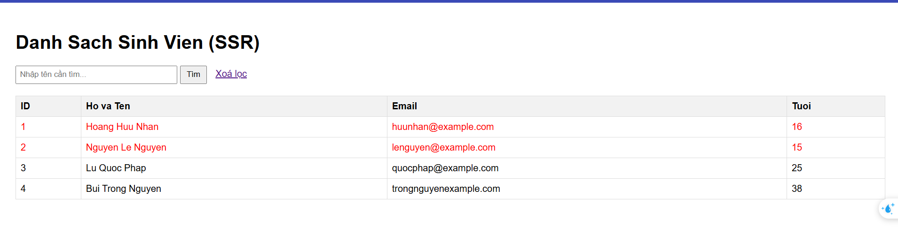
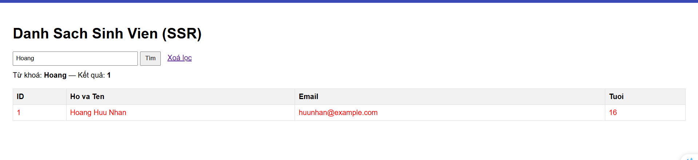

# Danh sách thành viên
| MSSV | Họ và tên |
| :--- | :--- |
| **2310271** | Trương Nguyễn Gia Bảo | 
| **2312419** | Hoàng Hữu Nhân | 

# Deploy Web service
Ứng dụng đã được triển khai trực tuyến tại:
**[https://student-management-5syw.onrender.com/students](https://student-management-5syw.onrender.com/students)**
> **Lưu ý:** Do sử dụng Render Free Tier, dịch vụ sẽ tự động "đi ngủ" sau 15 phút không hoạt động. Thời gian khởi động lại (Cold Start) có thể mất từ 1-5 phút.

# Hướng dẫn chạy dự án

1. Chạy Docker
```sql
docker run -d --name cnpmnc_postgre ^
  -e POSTGRES_USER=postgres ^
  -e POSTGRES_PASSWORD=123456 ^
  -e POSTGRES_DB=student_management ^
  -p 5433:5432 ^
  postgres:15-alpine
```

2. Tạo file .env

3. Chỉnh file  application.properties thêm các biến môi trường


4. Chạy lệnh 
```sql
mvnw clean package  
mvnw.cmd spring-boot:run
```

Truy cập vào đường dẫn localhost:8080/students để xem kết quả


# Lab 1: Khởi Tạo & Kiến Trúc Hệ Thống
## Bài tập 

1.  **Dữ liệu lớn**: Hãy thử thêm ít nhất **10 sinh viên** nữa.
    
**Thực hiện:** Thêm **10 sinh viên** mới.

```sql
INSERT INTO students (id, name, email, age) VALUES (3, 'Le Van C', 'levanc@example.com', 19);
INSERT INTO students (id, name, email, age) VALUES (4, 'Pham Thi D', 'phamthid@example.com', 20);
INSERT INTO students (id, name, email, age) VALUES (5, 'Hoang Van E', 'hoangvane@example.com', 21);
INSERT INTO students (id, name, email, age) VALUES (6, 'Vo Thi F', 'vothif@example.com', 22);
INSERT INTO students (id, name, email, age) VALUES (7, 'Do Van G', 'dovang@example.com', 18);
INSERT INTO students (id, name, email, age) VALUES (8, 'Bui Thi H', 'buithih@example.com', 19);
INSERT INTO students (id, name, email, age) VALUES (9, 'Nguyen Van I', 'nguyenvani@example.com', 20);
INSERT INTO students (id, name, email, age) VALUES (10, 'Tran Thi K', 'tranthik@example.com', 21);
INSERT INTO students (id, name, email, age) VALUES (11, 'Dang Van L', 'dangvanl@example.com', 22);
INSERT INTO students (id, name, email, age) VALUES (12, 'Mai Thi M', 'maithim@example.com', 20);
```


2.  **Ràng buộc Khóa Chính (Primary Key)**:
* Cố tình Insert một sinh viên có `id` trùng với một người đã có sẵn.
    ```sql
    -- Thêm một sinh viên có id trùng với sinh viên đã tồn tại
    INSERT INTO students (id, name, email, age) VALUES (1, 'Nguyen Van A', 'vana@example.com', 20);
    ```
    Kết quả:
    

*  Quan sát thông báo lỗi: `UNIQUE constraint failed`. Tại sao Database lại chặn thao tác này?

  * id được định nghĩa là PRIMARY KEY ⇒ bắt buộc UNIQUE và NOT NULL.

  * Nếu cho phép trùng id, DB không còn đảm bảo “mỗi sinh viên có 1 định danh duy nhất”, dẫn tới:

    * Lỗi logic khi truy vấn theo id (không biết lấy dòng nào),

    * Ảnh hưởng trực tiếp tới các thao tác CRUD sau này.


3.  **Toàn vẹn dữ liệu (Constraints)**:
*   Thử Insert một sinh viên nhưng bỏ trống cột `name` (để NULL).
    ``` sql
    - Thêm một sinh viên có thuộc tính name là NULL
    INSERT INTO students (id, name, email, age) VALUES (44, NULL, 'nonething@example.com', 20);
    ```
    *   Database có báo lỗi không? Từ đó suy nghĩ xem sự thiếu chặt chẽ này ảnh hưởng gì khi code Java đọc dữ liệu lên?
       
    * Database có báo lỗi không?

      * Database không báo lỗi

    * Sự thiếu chặt chẽ này ảnh hưởng gì khi code Java đọc dữ liệu lên?

    * Dữ liệu name = NULL dễ gây:

      * NullPointerException (NPE) nếu code xử lý chuỗi mà không check null (trim(), toLowerCase()…),

      * UI hiển thị trống tên (xấu UX, khó kiểm tra),

      * Logic tìm kiếm theo tên có thể “lọt” hoặc cho kết quả thiếu nhất quán,

      * Dữ liệu rác (không đúng nghiệp vụ: sinh viên không thể không có tên).
    
      

4.  **Cấu hình Hibernate: Tại sao mỗi lần tắt ứng dụng và chạy lại, dữ liệu cũ trong Database lại bị mất hết?**

* Nguyên nhân do trong application.properties đang cấu hình:
```
  spring.jpa.hibernate.ddl-auto=create
```
* Với ddl-auto=create khiến Hibernate mỗi lần chạy app sẽ:
  * Drop (xóa) bảng cũ nếu có
  * Create lại bảng mới theo @Entity → nên dữ liệu nhập trước đó bị mất sạch.


# Lab 2: Xây Dựng Backend REST API

## Kiểm tra API với trình duyệt
1. **API lấy danh sách sinh viên**: GET http://localhost:8080/api/students


2. **API lấy chi tiết sinh viên**: GET http://localhost:8080/api/students/1


3. **Lấy chi tiết sinh viên không tồn tại** GET http://localhost:8080/students/99


# Lab 3: Xây dựng Frontend (SSR)
**Giao diện sẽ hiển thị danh sách các sinh viên và tô đỏ các bảng ghi sinh viên có tuổi < 18 (http://localhost:8080/students)**



**Chức năng tìm kiếm:** 




# Lab 4: Hoàn thiện sản phẩm
**Module 1: Danh sách sinh viên**
* Đường dẫn: {URL}/students


**Module 2: Trang chi tiết sinh viên**
* Đường dẫn: {URL}/students/id

Khi ấn vào nút xem hồ sơ một dòng dữ liệu sinh viên bất kì, chuyển đến trang chi tiết thông tin của sinh viên đó


**Tại trang này, ta có thể chỉnh sửa thông tin sinh viên hoặc xóa sinh viên.**
* Khi ấn sửa thông tin sinh viên, chuyển đến form sửa thông tin sinh viên.

  

* Sau khi ấn lưu, chuyển hướng về trang thông tin chi tiết của sinh viên vừa được chỉnh sửa với thông tin đã được cập nhật.

  

* Quay lại trang chi tiết sinh viên, khi ta ấn xóa, app sẽ hiện popup yêu cầu xác nhận
  
* Sau khi bấm xóa, chuyển về trang danh sách sinh viên và bản ghi đã được xóa thành công (không còn tìm kiếm được sinh viên tên Bảo)
  

**Module 3: Trang thêm mới sinh viên**
*Đường dẫn: {URL}/students/add

Khi ấn nút thêm sinh viên, form tạo sinh viên sẽ hiện lên


Sau khi ấn xác nhận, chuyển về trang hồ sơ sinh viên để kiểm tra coi đã điền đúng thông tin hay chưa

